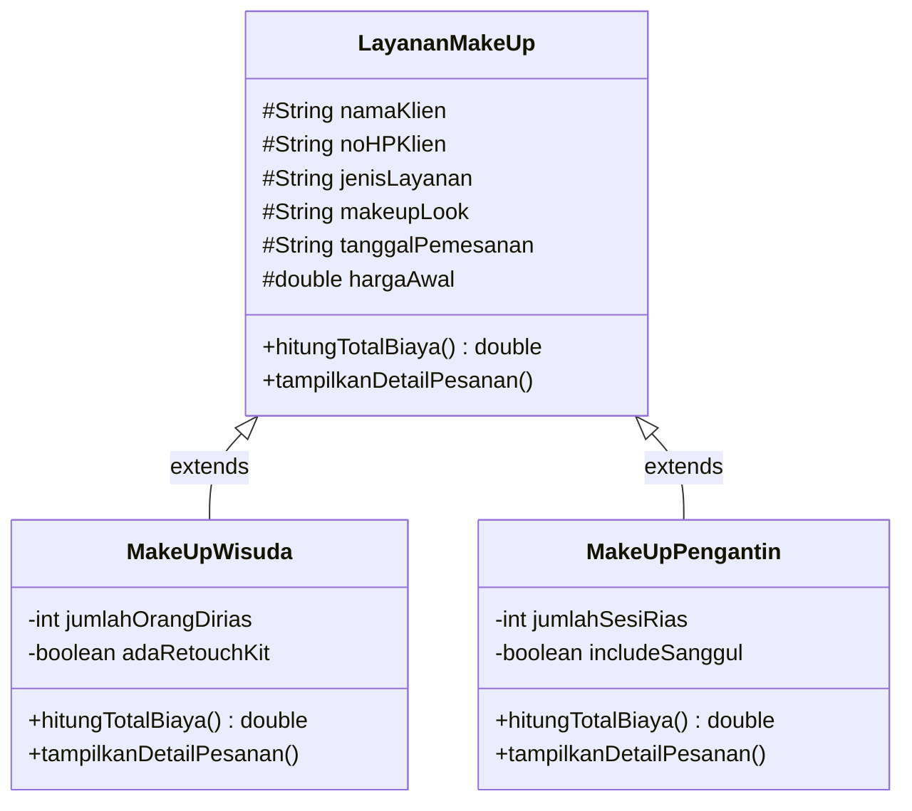

# MK-PBO-Sistem-Pengelolaan-Jasa-Make-Up
Nama : Sabrina Azhmalia Nisa

NIM : 2509116051

Kelas : Sistem Informasi B

## Penjelasan Studi Kasus
Program ini merupakan program berbasis konsol atau _command line_ yang mensimulasikan seorang Make Up Artist (MUA) untuk memanajemen usaha jasa make up mereka, mulai dari pencatatan data klien atau pelanggan, pemilihan kategori layanan, hingga perhitungan total biaya secara otomatis. Program ini berfokus pada jenis make up yang paling sering dipesan oleh masyarakat. Umumnya seorang MUA menawarkan lebih dari satu jenis layanan make up, seperti pada program ini yang menawarkan jenis layanan make up wisuda dan make up pengantin. 

Pada kedua jenis layanan tersebut memiliki karakteristik yang berbeda, baik dari segi harga dasar, cara perhitungan biaya, maupun detail tambahan yang ditawarkan. Pengelolaan pesanan secara manual akan menyulitkan MUA dalam mencatat data klien maupun menghitung total biaya secara konsisten. Maka dari itu, dibuatlah sistem ini agar menyelesaikan permasalahan tersebut. Adapun detail dari jenis make up tersebut pada program ini, antara lain:
|Kategori	| Harga Dasar |	Rumus Perhitungan Biaya |	Detail Tambahan|
|-----------|-----------|-----------|-----------|
|Make Up Wisuda |	Rp250.000 / orang	| Harga Dasar × Jumlah Orang + (Retouch Kit)	| Jumlah orang dirias, opsi Retouch Kit (+Rp50.000)|
|Make Up Pengantin |	Rp1.000.000 / sesi	| Harga Dasar × Jumlah Sesi + (Sanggul/Hairdo)	| Jumlah sesi rias, opsi Sanggul/Hairdo (+Rp200.000)|

## Penjelasan Hierarki Class
Pada program ini terdiri dari empat class yang saling berkaitan. Struktur hierarki class tersebut, antara lain:

Untuk class `SistemJasaMUA` tidak dimasukkan ke dalam diagram di atas karena class tersebut memiliki peran sebagai program utama yang menjalankan menu dan memanggil ketiga class tersebut, sehingga class `SistemJasaMUA` bukan bagian dari hierarki pewarisan. Adapun penjelasan terakit class pada program ini adalah sebagai berikut:
1.  `SistemJasaMUA` (Main Class)

Pada class ini memiliki peran sebagai program utama yang menjalankan menu interaktif berbasis konsol. Class ini bertugas menangani seluruh input dari pengguna, melakukan validasi data, membuat objek `MakeUpWisuda` atau `MakeUpPengantin` sesuai pilihan pengguna, serta menampilkan hasilnya.

2. `LayananMakeUp` (Superclass)

Pada class ini merupakan class induk yang menyimpan seluruh atribut umum yang dimiliki oleh semua jenis layanan make up. Class ini bersifat umum karena informasi seperti nama klien, nomor _handphone_, tanggal pemesanan atau tanggal pengerjaan, dan tampilan make up atau make up look yang pasti dibutuhkan oleh semua kategori layanan make up.

3. `MakeUpWisuda` (Subclass)

Pada class ini mewarisi seluruh atribut dan method dari `LayananMakeUp`, kemudian ditambah dengan atribut dan perilaku khusus yang dimiliki oleh layanan make up wisuda, yaitu jumlah orang yang dirias dan opsi Retouch Kit atau set make up berukuran kecil yang berfungsi untuk merapikan make up agar tetap kelihatan _fresh._

4. `MakeUpPengantin` (Subclass)

Pada class ini sama seperti `MakeUpWisuda` di mana class ini juga mewarisi `LayananMakeUp`, namun dengan atribut tambahan yang relevan untuk make up pengantin, yaitu jumlah sesi rias seperti saat resepsi atau acara dan opsi sanggul atau hairdo.
## Penerapan Inheritance
Konsep inheritance atau pewarisan diterapkan pada program ini dengan menjadikan `LayananMakeUp` sebagai superclass, sedangkan `MakeUpWisuda` dan `MakeUpPengantin` sebagai subclass yang mewarisinya melalui kode extends. Berikut penerapan inheritance pada program ini.

Penerapan inheritance pada program ini dilakukan dengan tujuan, antara lain:
- Kode tidak terduplikasi, atribut dan method yang bersifat umum cukup ditulis satu kali di `LayananMakeUp`, sehingga otomatis dapat digunakan oleh kedua subclass tanpa perlu menulis ulang.
- Pemanggilan constructor induk melalui super(). Setiap subclass memanggil constructor `LayananMakeUp` menggunakan super(...) untuk mengisi data umum, sebelum melanjutkan pengisian atribut khususnya masing-masing. Berikut penggunaan super(...) pada program ini.

Dengan struktur ini, penambahan kategori layanan baru dapat dilakukan dengan mudah, yaitu cukup dengan membuat satu subclass baru yang mewarisi `LayananMakeUp` tanpa perlu mengubah struktur program yang sudah ada.
## Dokumentasi Program
### 1. Menu Utama

### 2. Pilihan 1, Menambahkan Data Pemesanan Klien atau Pelanggan Baru

### 3. Pilihan 2, Melihat Semua Daftar Pemesanan

### 4. Pilihan 3, Keluar dari Program

## Validasi Input
### 1. Menu Utama

### 2. Input Nomor _Handphone_ Klien atau Pelanggan

### 3. Input Tanggal Pengerjaan

### 4. Input Kategori Make Up

